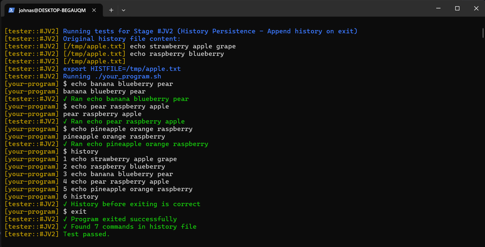
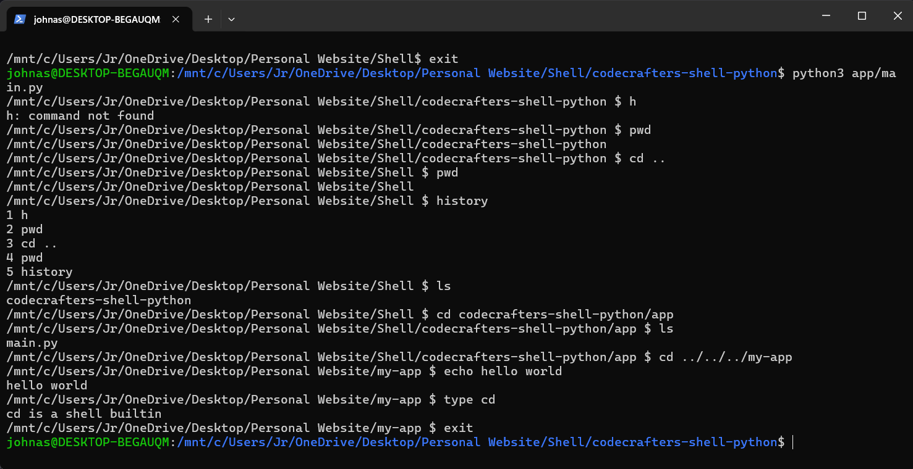
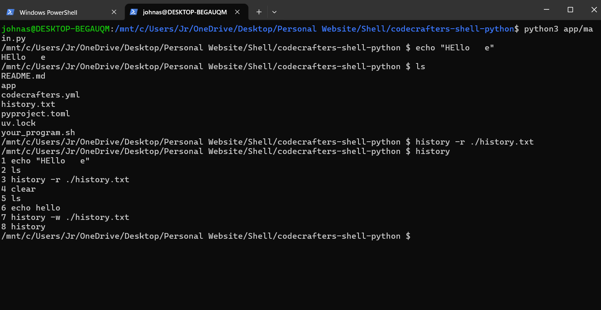
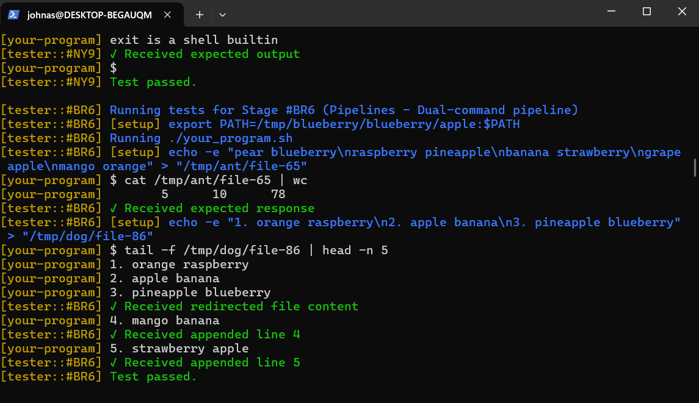
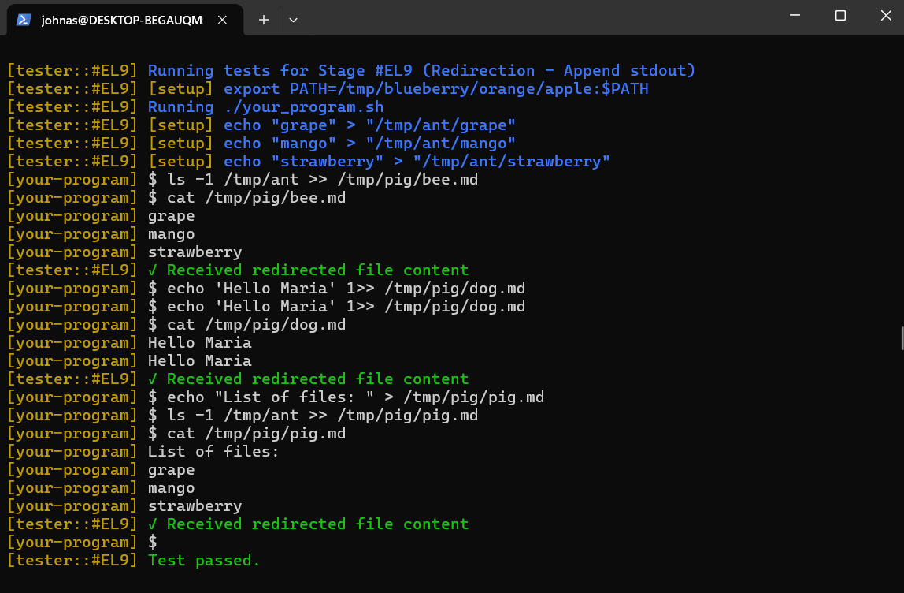
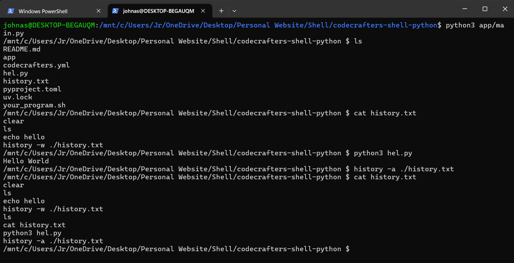
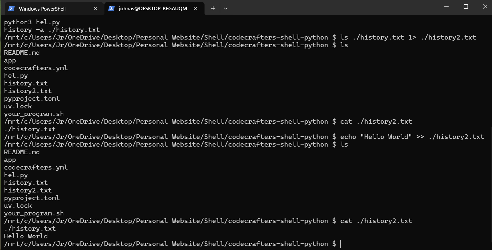

[](https://app.codecrafters.io/users/codecrafters-bot?r=2qF)

# Build Your Own Shell - Python Implementation

This is my solution to the ["Build Your Own Shell" Challenge](https://app.codecrafters.io/courses/shell/overview) from CodeCrafters.

A POSIX-compliant shell implementation in Python that's capable of interpreting shell commands, running external programs, and executing builtin commands like `cd`, `pwd`, `echo`, `type`, `exit`, and `history`. This project demonstrates shell command parsing, REPLs, file redirection, pipelines, and command history persistence.

---

## 🎯 Features Implemented

### ✅ Core Builtin Commands
- **`pwd`** - Print working directory
- **`cd`** - Change directory with support for relative and absolute paths
- **`echo`** - Display text with proper whitespace handling
- **`type`** - Identify whether a command is a builtin or external program
- **`exit`** - Exit the shell gracefully

### ✅ Command History
- **History tracking** - All executed commands are tracked
- **`history`** - Display numbered command history
- **`history -w <file>`** - Write history to a file
- **`history -a <file>`** - Append history to a file
- **`history -r <file>`** - Read history from a file
- **Persistent history** - History persists across shell sessions using `HISTFILE`

### ✅ I/O Redirection
- **Output redirection** (`>`) - Redirect stdout to a file
- **Append redirection** (`>>`) - Append stdout to a file
- **Input redirection** - Support for redirecting input from files
- **File descriptor redirection** (`1>`, `2>`) - Redirect specific file descriptors

### ✅ Pipelines
- **Single pipelines** (`|`) - Chain commands together
- **Dual-command pipelines** - Connect output of one command to input of another
- **Complex pipeline chains** - Support for multiple piped commands

### ✅ External Command Execution
- **PATH resolution** - Find and execute programs in system PATH
- **Command execution** - Run external programs with arguments
- **Error handling** - Proper handling of unknown commands

---

## 📸 Screenshots

### Stage Completions

#### 🔹 File Redirection (Stage #EL9)
Successfully implemented append stdout redirection with the `>>` operator.



*Testing file redirection with `ls`, `cat`, and `echo` commands with append operations*

---

#### 🔹 Command History Tracking
Implemented command history with write and append functionality.



*Demonstrating `history -w` and `history -a` commands to persist shell history*

---

#### 🔹 History with File Operations
History commands working seamlessly with file redirection.



*Creating multiple history files and managing command history across sessions*

---

#### 🔹 History Persistence (Stage #JV2)
History persists across shell sessions and properly appends on exit.



*Testing history persistence with `HISTFILE` environment variable - 7 commands tracked successfully*

---

#### 🔹 Builtin Commands & Navigation
Core builtin commands working correctly with directory navigation.



*Testing `pwd`, `cd`, `history`, `ls`, `echo`, and `type` commands with complex path navigation*

---

#### 🔹 Advanced History Features
History read operations and command tracking.



*Using `history -r` to read history from file and displaying numbered command list*

---

#### 🔹 Pipelines & Exit Builtin (Stages #BR6 & #NY9)
Dual-command pipelines working with `tail`, `head`, `cat`, and `wc`.



*Successfully chaining commands with pipes and proper exit builtin recognition*

---

## 🚀 Getting Started

### Prerequisites
- Python 3.x
- `uv` package manager installed locally

### Running the Shell

1. Clone this repository:
```sh
git clone https://github.com/Johnas-Bautista/codecrafters-shell-python.git
cd codecrafters-shell-python
```

2. Run the shell:
```sh
./your_program.sh
```

Or directly with Python:
```sh
python3 app/main.py
```

---

## 📝 Passing Stages

### First Stage
The entry point for the shell implementation is in `app/main.py`. Study and uncomment the relevant code, then push your changes:

```sh
git commit -am "pass 1st stage"
git push origin master
```

### Stage 2 & Beyond
1. Ensure you have `uv` installed locally
2. Run `./your_program.sh` to test your implementation
3. Commit your changes and run `git push origin master` to submit your solution
4. Test output will be streamed to your terminal

---

## 🏆 Completed Stages

- ✅ REPL Implementation
- ✅ Command Parsing
- ✅ Builtin Commands (`exit`, `echo`, `type`, `pwd`, `cd`)
- ✅ External Command Execution
- ✅ PATH Resolution
- ✅ Output Redirection (`>`)
- ✅ Append Redirection (`>>`)
- ✅ Command History
- ✅ History Persistence
- ✅ History File Operations
- ✅ Pipelines (Single & Dual-command)

---

## 🛠️ Technical Details

### Project Structure
```
codecrafters-shell-python/
├── app/
│   └── main.py          # Main shell implementation
├── your_program.sh      # Shell runner script
├── codecrafters.yml     # CodeCrafters configuration
├── pyproject.toml       # Python project configuration
└── README.md            # This file
```

### Key Implementation Features
- **REPL (Read-Eval-Print Loop)** - Interactive command prompt
- **Command parser** - Tokenizes and parses shell commands
- **PATH resolution** - Searches for executables in system PATH
- **Process management** - Forks and executes external programs
- **I/O redirection** - Handles file descriptors and redirection operators
- **Pipeline execution** - Connects multiple commands via pipes
- **History management** - Tracks, persists, and retrieves command history

---

## 📚 Learning Outcomes

Through this project, I've gained hands-on experience with:
- Shell command parsing and tokenization
- Process creation and management in Python
- File descriptor manipulation and I/O redirection
- Inter-process communication using pipes
- Command history implementation and persistence
- REPL design patterns
- POSIX shell compliance and standards

---

## 🔗 Links

- [CodeCrafters Challenge](https://app.codecrafters.io/courses/shell/overview)
- [My Progress](https://backend.codecrafters.io/progress/shell/d0d2a094-19d1-40f5-ba5b-1ab38347e93e)

---

## 📄 License

This project is part of the CodeCrafters learning platform.

---

**Note**: If you're viewing this repo on GitHub, head over to [codecrafters.io](https://codecrafters.io) to try the challenge yourself!